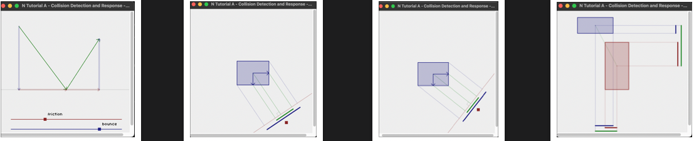
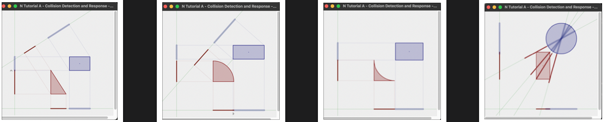
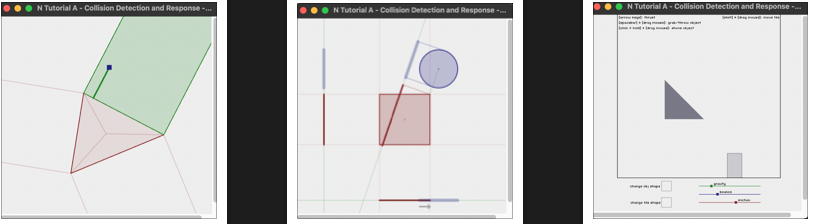

# Projeto sobre colisão 2D

  

Objetivo

Aprender a desenvolver os exemplos que representam a colisão, ou seja, não iremos apenas modelar um exemplo final, 
a idéia principal aqui é criar os exemplos que representam conceitos de fisica e matematica, para que a partir da compreesão pratica, possamos transitar por todas as etapas da Box2d Lite.
Mas ao invés de apenas fazer os exemplos isolados, eu criei um projeto usando os conceitos de S.O.L.I.D, com a separação das camadas.

  
  
  

Source code with basic collision with ImgGui

Refencias:
https://gamesfromwithin.com/when-is-it-ok-not-to-tdd
https://www.metanetsoftware.com/technique/tutorialA.html
https://github.com/erincatto/box2d-lite

Tecnologias:
    C++17
    Cmake 3.20(https://cmake.org/cmake/help/latest/release/3.20.html)
    Vscode 1.78.2 (Com tasks e launch.js)
    Apple clang version 14.0.3 (clang-1403.0.22.14.1)
    GoogleTest(https://github.com/google/googletest)
    Render (Glew,Glad,ImgGui)

        

    
     